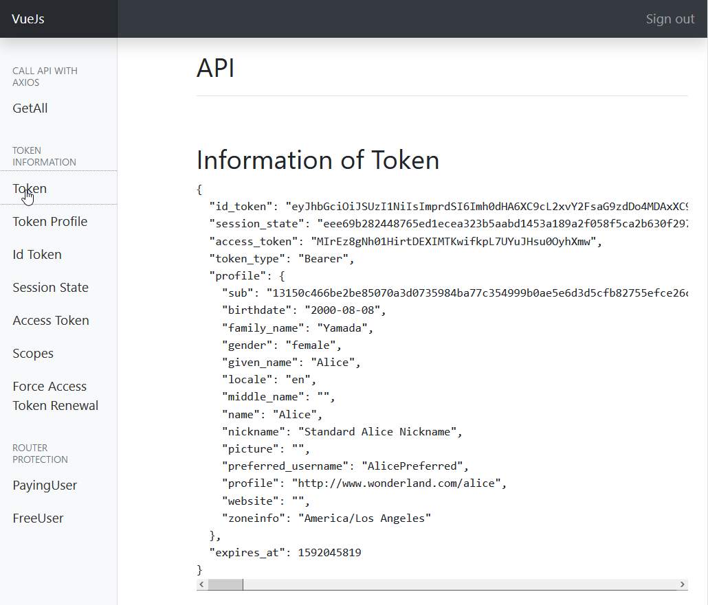

= vuejsoidcclient

https://github.com/joaojosefilho/vuejsOidcClient[vuejsoidcclient] is a https://vuejs.org/[Vue.js] project relying on with https://github.com/IdentityModel/oidc-client-js[oidc-client library].

Any settings applying here for vuejsoidcclient should apply to https://github.com/IdentityModel/oidc-client-js[oidc-client library].

NOTE: The project has been tested will the latest available version of the https://github.com/IdentityModel/oidc-client-js[oidc-client library] at the time of this writing: 1.10.1.

== Development environment

This example relies on:

* The Docker Compose configuration as described in https://github.com/r3dlin3/phpOIDC/#5-minutes-quickstart[the 5 minutes quickstart] of https://github.com/r3dlin3/phpOIDC[phpOIDC]
* The build-in webpack server used by the project

This example assumes that you have already cloned both project and have phpOIDC running.

WARNING: All URLs must be adapted to your environment if you are not using the out-of-the-box configuration.

== Configuration

=== vuejsoidcclient configuration

Edit the file `src\services\SecurityService.js` and edit the UserManager configuration:
[source,javascript]
----
var mgr = new Oidc.UserManager({
  userStore: new Oidc.WebStorageStateStore(),  
  authority: 'http://localhost:8001/phpOp', <1>
  client_id: 'vuejsclient', <2>
  redirect_uri: window.location.origin + '/static/callback.html',
  response_type: 'id_token token',<3>
  scope: 'openid profile', <4>
  post_logout_redirect_uri: window.location.origin + '/index.html',
  silent_redirect_uri: window.location.origin + '/static/silent-renew.html',
  accessTokenExpiringNotificationTime: 10,
  automaticSilentRenew: true,
  filterProtocolClaims: true,
  loadUserInfo: true
})
----
<1> Change the URL. Here is the default URL of Docker Compose but must be adapted to your environment
<2> [[b-client-id]] Note the client ID for later
<3> No change here. Note the response type for later
<4> Set the scope to your needs. Note that phpOIDC only supports the basic scopes (see https://openid.net/specs/openid-connect-core-1_0.html#ScopeClaims[Requesting Claims using Scope Values]).

=== phpOIDC

1. Open the URL http://localhost:8001/phpOp/admin/client/ and click "New Row" or go directly to http://localhost:8001/phpOp/admin/client/index.php?action=new
2. Fill in the form with at least the following information:
Client Id:: Must be the same as defined earlier (see <<b-client-id, client_id>>)
Client Name:: This is just a display name
Redirect Uris:: `http://localhost:8080/static/callback.html|http://localhost:8080/static/silent-renew.html` as defined in the parameters `redirect_uri` and `silent_redirect_uri` of `UserManager`. Note that the separator is `|`. 
Post Logout Redirect Uri:: `http://localhost:8080/index.html` as defined in the parameter `post_logout_redirect_uri` of `UserManager`
Grant Types:: `implicit`
Response Types:: `id_token token` to get an ID token and an access token

== Testing

1. Run vuejsoidcclient by executing `npm run dev`.
2. Access the URL http://localhost:8080/
3. After authentication and consent, you will be able to get information from tokens:

