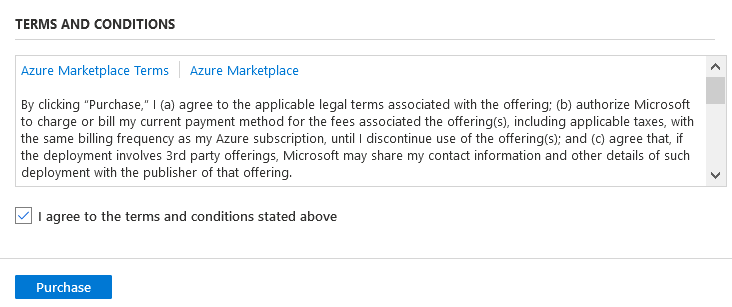
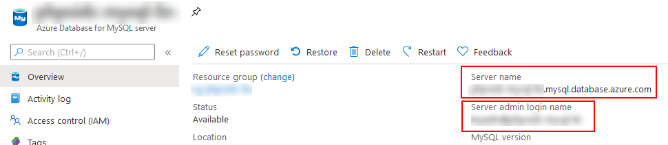

= Deployment of phpOIDC to an Azure App Service Linux using Docker
:icons: font

CAUTION: These templates only deploy the OpenID Connect Provider *without* the testing OpenID Connect Relying Party

Here are some points worth noting:

* MySQL Server firewall is set to prevent access from Azure and only accept connection coming from the App Service
* HTTPS is enforced
* The image from https://hub.docker.com/r/phpoidc/phpoidc[Docker Hub] is used

[WARNING]
====
The purpose of these templates is to give you a kick-start, instantiating all of the required resources to run phpOIDC in Azure. *It should be used for testing only*.
For instance, here are things that should be fixed for production:

* *The used keys are for demo*
* SSL is not enforced by MySQL and not used by the PHP Code
* PHP Code is using administrator's credentials, not a dedicated account
====

== What is being deployed

* Azure App Service: The App service will be configured to use PHP
* App Service plan: In these templates, a *Linux* App Service is used
* Azure Database for MySQL: Its firewall is set based on the App Service IP

You can click on the button to visualize the deployed resources:
image:https://raw.githubusercontent.com/Azure/azure-quickstart-templates/master/1-CONTRIBUTION-GUIDE/images/visualizebutton.svg?sanitize=true[title="Visualize", link="http://armviz.io/#/?load=https%3A%2F%2Fraw.githubusercontent.com%2Fr3dlin3%2FphpOIDC%2Fmaster%2Finfra%2Fazure-linux%2Fazuredeploy.json"]

== How to deploy

NOTE: The templates use https://docs.microsoft.com/en-us/azure/azure-resource-manager/templates/linked-templates[nested templates].

It is possible to use the portal (cf. <<One-button click>>), by using <<Powershell>> or <<Azure CLI>>.

In any case, the following tables describes the parameters.

After deployment of the resources, there is an additional step described in the paragraph <<Post-deployment>> to create the database schema.

[cols="3", options="header"]
|===
|Parameter Name
|Component
|Description

|siteName
|App Service
|Name of azure web app. The application will be accessible from https://<siteName>.azurewebsites.net

|appServicePlanName
|App Service Plan
|Name of hosting plan

|skuName
|App Service Plan
|Sku for the App service plan

|capacity
|App Service Plan
|Current number of instances assigned to the resource

|mysqlServerName
|MySQL
|Server Name for Azure database for MySQL

|administratorLogin
|MySQL
|Database administrator login name

|administratorPassword
|MySQL
|Database administrator password

|databaseForMySqlName
|MySQL
|Name of the Azure Database for MySQL

|databaseSkuName
|MySQL
|Azure database for MySQL sku name

|_artifactsLocation
|General
|The base URI where artifacts required by this template are located.

|_artifactsLocationSasToken
|General
|The sasToken required to access _artifactsLocation.

|tags
|General
|tags to apply to resources

|location
|General
|The region to deploy the resources into
|===

=== One-button click

. Click on the button below:

image::https://raw.githubusercontent.com/Azure/azure-quickstart-templates/master/1-CONTRIBUTION-GUIDE/images/deploytoazure.svg?sanitize=true["Deploy To Azure", link="https://portal.azure.com/#create/Microsoft.Template/uri/https%3A%2F%2Fraw.githubusercontent.com%2Fr3dlin3%2FphpOIDC%2Fmaster%2Finfra%2Fazure-linux%2Fazuredeploy.json"]

[start=2]
. Fill the form with the parameters as described in the table above. 
You can use an existing resource group or create one on the fly.
Keep in mind that certain name must be globally unique, like the app service name or the name of the MySQL server.

image::assets/portal-form.png[Portal form]

[start=3]
. Check "I agree to the terms and conditions stated above" and click on the button "Purchase".

[start=4]
. If there is no validation error, the deployment starts.

image::assets/portal-inprogress.png[purchase]

[start=5]
. Finally, after a while, the resources are deployed.

image::assets/portal-success.png[purchase]

=== PowerShell

The following commands suppose that:

- You have Az modules
- You are logged using `Connect-AzAccount`

[source, powershell]
----
# Create a resource group if not already exists
$rg = "" # Specify a name for the resource group
New-AzResourceGroup -Name $rg -Location FranceCentral

# Define parameters for template deployment - remember to change the values!
$siteName=""
$appServicePlanName=""
$skuName=""
$capacity=""
$mysqlServerName=""
$administratorLogin=""
# To prompt to get the password
$administratorPassword=Read-Host -AsSecureString
# Hardcoded
$administratorPassword=ConvertTo-SecureString 'MySuperSecretP@ssw0rd!' –asplaintext –force 
$databaseForMySqlName=""
$databaseSkuName="phpoidc"
$templateuri = "https://raw.githubusercontent.com/r3dlin3/phpOIDC/master/infra/azure-linux/azuredeploy.json"

New-AzResourceGroupDeployment -ResourceGroupName $rg `
                              -TemplateUri $templateUri `
                              -siteName $siteName `
                              -appServicePlanName $appServicePlanName `
                              -skuName $skuName `
                              -capacity $capacity `
                              -mysqlServerName $mysqlServerName `
                              -administratorLogin $administratorLogin `
                              -administratorPassword $administratorPassword `
                              -databaseForMySqlName $databaseForMySqlName `
                              -databaseSkuName $databaseSkuName `
                              -Verbose
----

=== Azure CLI

The following commands are provided for Bash.
It must be adapted to be run on Windows.

[source, bash]
----
# Create a resource group if not already exists
# Specify a name for the resource group
rg="" 
az group create --name $rg --location FranceCentral

# Define parameters for template deployment - remember to change the values!
siteName=""
appServicePlanName=""
skuName="B1"
mysqlServerName=""
administratorLogin=""
# To prompt to get the password
administratorPassword=""
databaseForMySqlName="phpoidc"
databaseSkuName="B_Gen5_1"

# Create MySQL 
az mysql server create --resource-group $rg --name $mysqlServerName  --admin-user $administratorLogin --admin-password $administratorPassword --sku-name $databaseSkuName 

# Create The App Service Plan
az appservice plan create --name $appServicePlanName --resource-group $rg --is-linux --sku $skuName

# Create the web app
az webapp create --resource-group $rg --plan $appServicePlanName --name $siteName --deployment-container-image-name phpoidc/phpoidc:phpop

az webapp config appsettings set --resource-group $rg --name $siteName --settings WEBSITES_PORT=8001  OP_URL="https://$siteName.azurewebsites.net" DB_DATABASE=$databaseForMySqlName DB_HOST="$mysqlServerName.mysql.database.azure.com" DB_PORT=3306 DB_TYPE=mysql DB_USER=$administratorLogin DB_PASSWORD=$administratorPassword  
----

== Post-deployment

The database schema must be initialized. 
There are several ways to create the schema.

One way is to run the SQL script to create the database use MySQL client. You can use https://docs.microsoft.com/en-us/azure/mysql/connect-workbench[MySQL Workbench].

The script is available in this repo in `phpOp\create_db.sql`.

NOTE: Under Windows, I have used the docker image `mysql:latest` to execute the SQL script.

[TIP]
====
You can go in the Azure portal to look for the exact server name and the user name to use with the MySQL client:

====